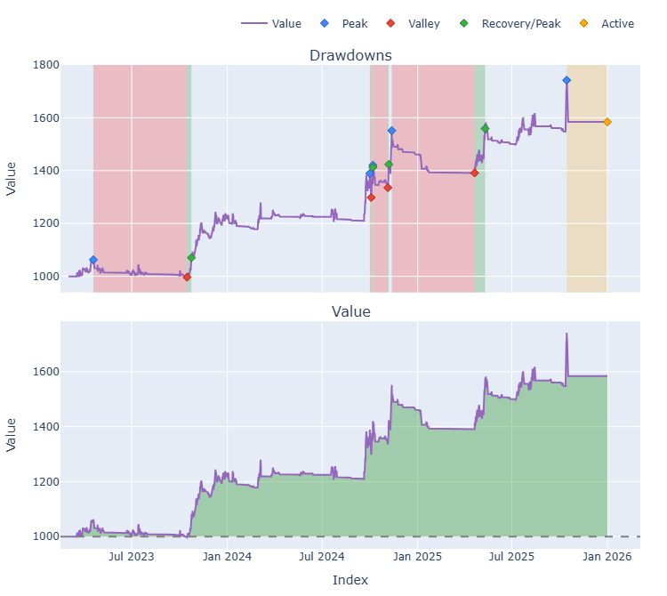
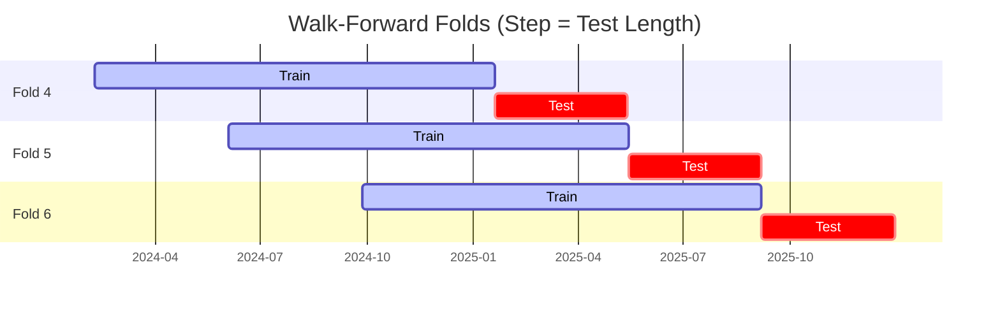

# Trading Strategy Pipeline Report

**Generated**: 2026-03-29 11:55:23

## Executive Summary

**WFO Training/Test period:** n/a  
**Coins:** 8

| | WFO Full Range | YTD |
|-|----------------|--------|
| Strategy CAGR | n/a | n/a |
| BTC buy & hold CAGR | n/a | n/a |
| S&P 500 CAGR | n/a | n/a |
| Strategy Sharpe | n/a | n/a |
| Max Drawdown | n/a | n/a |
| Total Trades | 0 | n/a |
| Win Rate | n/a | n/a |

### Full Range Portfolio

## Result Validation (Training/Test Data)
**Period: n/a** — WFO-selected parameters replayed on the full training/test range.

### Combined Portfolio Performance

| Metric | Strategy | BTC (buy & hold) | S&P 500 (SPY) | Excess vs BTC |
|--------|----------|------------------|---------------|---------------|
| Total Return | n/a | n/a | n/a | - |
| CAGR | n/a | n/a | n/a | n/a |
| Sharpe Ratio | n/a | n/a | n/a | - |
| Max Drawdown | n/a | n/a | n/a | - |
| Total Trades | 0 | 1 | 1 | - |
| Win Rate | n/a | - | - | - |

## YTD Performance

*Not executed.*

## Per-Coin Strategy Selection (WFO)

Best performing strategy per coin based on robustness scores (highest first).

| Symbol | Strategy | Selection | Robustness Score |
|--------|----------|-----------|------------------|
| ZEC-USD | macd_cross+atr_trailing | wfo_robustness | 0.8539 |
| ETH-USD | donchian_breakout+atr_trailing | wfo_robustness | 0.6991 |
| DOGE-USD | rsi_reversal+fixed_sl_tp | wfo_robustness | 0.6680 |
| TAO-USD | psar_adx+atr_trailing | wfo_robustness | 0.6600 |
| XRP-USD | rsi_reversal+atr_trailing | wfo_robustness | 0.5337 |
| SOL-USD | ema_cross+atr_trailing | wfo_robustness | 0.4926 |
| ADA-USD | supertrend_flip+fixed_sl_tp | wfo_robustness | 0.3876 |
| SUI-USD | rsi_reversal+fixed_sl_tp | wfo_robustness | 0.1398 |

### WFO Fold Timeline

### WFO Out-of-Sample Sharpe — Per Fold

Per-fold OOS Sharpe for each coin's winning strategy (folds ordered as above). Negative = strategy did not generalise.

| Symbol | Strategy+Exit | IS Rob | OOS Rob | Consistency | Fold 1 | Fold 2 | Fold 3 | Fold 4 | Fold 5 | Fold 6 |
|--------|---------------|--------|---------|-------------|--------|--------|--------|--------|--------|--------|
| ETH-USD | donchian_breakout+atr_trailing | 1.1686 | 0.8048 | 67% | 0.894 | -2.692 | 1.613 | 3.691 | 2.733 | -1.205 |
| ZEC-USD | macd_cross+atr_trailing | 1.7906 | 0.7875 | 67% | nan | nan | nan | 1.058 | -0.342 | 1.824 |
| TAO-USD | psar_adx+atr_trailing | 1.9649 | 0.2958 | 67% | nan | nan | 1.162 | -0.899 | 0.807 | n/a |
| XRP-USD | rsi_reversal+atr_trailing | 2.4924 | -0.0284 | 50% | -2.932 | -0.812 | 3.436 | 0.546 | 0.533 | -1.814 |
| DOGE-USD | rsi_reversal+fixed_sl_tp | 2.7010 | -0.0841 | 67% | 0.972 | -1.232 | 1.892 | 1.183 | 1.890 | -3.585 |
| SOL-USD | ema_cross+atr_trailing | 2.2321 | -0.1914 | 67% | 0.575 | -0.504 | 1.240 | 0.805 | 1.001 | -2.902 |
| ADA-USD | supertrend_flip+fixed_sl_tp | 2.7268 | -0.2758 | 33% | -4.387 | -1.491 | 3.393 | -0.288 | 1.198 | -2.350 |
| SUI-USD | rsi_reversal+fixed_sl_tp | 2.6187 | -0.9800 | 33% | -3.511 | -0.842 | 1.033 | 0.045 | -0.044 | -3.832 |

## Full-Period Performance (Per-Coin)

Performance metrics from running WFO-selected parameters on full-range data.

---

*For pipeline methodology, fold structure, and benchmark definitions see [docs/UNIFIED_PIPELINE.md](../docs/UNIFIED_PIPELINE.md).*

---

*Report generated by ggTrader Pipeline*