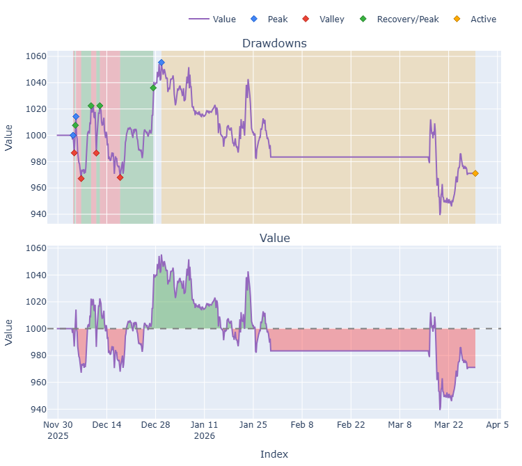
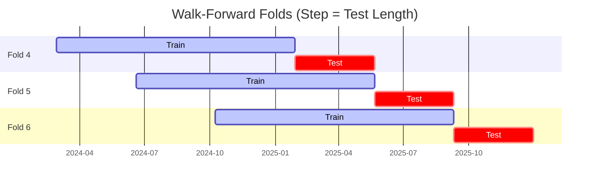

# Trading Strategy Pipeline Report

**Generated**: 2026-03-29 12:56:32

## Executive Summary

**WFO Training/Test period:** 2023-03-02 -> 2025-12-31  
**YTD performance window:** 2025-11-29 -> 2026-03-29  
**Coins:** 25

| | WFO Full Range | YTD |
|-|----------------|--------|
| Strategy CAGR | 13.15% | -8.55% |
| BTC buy & hold CAGR | 58.38% ❌ | -14.00% ✅ |
| S&P 500 CAGR | 23.89% ❌ | -17.86% ✅ |
| Strategy Sharpe | 1.03 | -0.37 |
| Max Drawdown | -7.40% | -10.99% |
| Total Trades | 154 | 68 |
| Win Rate | 37.01% | 14.71% |

### YTD Portfolio

## Result Validation (Training/Test Data)
**Period: 2023-03-02 -> 2025-12-31** — WFO-selected parameters replayed on the full training/test range.

### Combined Portfolio Performance

| Metric | Strategy | BTC (buy & hold) | S&P 500 (SPY) | Excess vs BTC |
|--------|----------|------------------|---------------|---------------|
| Total Return | 41.98% | 268.43% | 83.58% | - |
| CAGR | 13.15% | 58.38% | 23.89% | -45.23% |
| Sharpe Ratio | 1.0295 | 1.2214 | 1.3212 | - |
| Max Drawdown | -7.40% | -34.46% | -14.53% | - |
| Total Trades | 154 | 1 | 1 | - |
| Win Rate | 37.01% | - | - | - |

## YTD Performance
**Period: 2025-11-29 -> 2026-03-29** — WFO-selected parameters replayed on the YTD window, no re-optimization.

| Metric | Strategy | BTC (buy & hold) | S&P 500 (SPY) | Excess vs BTC |
|--------|----------|------------------|---------------|---------------|
| Total Return | -2.89% | -4.83% | -6.26% | - |
| CAGR | -8.55% | -14.00% | -17.86% | 5.45% |
| Sharpe Ratio | -0.3673 | -0.5319 | -2.8335 | - |
| Max Drawdown | -10.99% | -9.96% | -6.26% | - |
| Total Trades | 68 | 1 | 1 | - |
| Win Rate | 14.71% | - | - | - |

## Per-Coin Strategy Selection (WFO)

Best performing strategy per coin based on robustness scores (highest first).

| Symbol | Strategy | Selection | Robustness Score |
|--------|----------|-----------|------------------|
| KAS-USD | rsi_reversal+atr_trailing | wfo_robustness | 1.2270 |
| SPX-USD | supertrend_flip+trailing_stop | wfo_robustness | 0.9356 |
| ZEC-USD | macd_cross+atr_trailing | wfo_robustness | 0.8539 |
| ZRO-USD | psar_adx+atr_trailing | wfo_robustness | 0.7975 |
| ETH-USD | donchian_breakout+atr_trailing | wfo_robustness | 0.6991 |
| CRV-USD | donchian_breakout+atr_trailing | wfo_robustness | 0.6697 |
| DOGE-USD | rsi_reversal+fixed_sl_tp | wfo_robustness | 0.6680 |
| TAO-USD | psar_adx+atr_trailing | wfo_robustness | 0.6600 |
| XLM-USD | ema_cross+trailing_stop | wfo_robustness | 0.5954 |
| XRP-USD | rsi_reversal+atr_trailing | wfo_robustness | 0.5337 |
| SOL-USD | ema_cross+atr_trailing | wfo_robustness | 0.4926 |
| LINK-USD | rsi_reversal+atr_trailing | wfo_robustness | 0.4784 |
| NEAR-USD | macd_cross+fixed_sl_tp | wfo_robustness | 0.4547 |
| AKT-USD | ema_cross+atr_trailing | wfo_robustness | 0.4532 |
| WIF-USD | psar_adx+trailing_stop | wfo_robustness | 0.4032 |
| ADA-USD | supertrend_flip+fixed_sl_tp | wfo_robustness | 0.3876 |
| PEPE-USD | psar_adx+trailing_stop | wfo_robustness | 0.3619 |
| AVAX-USD | ema_cross+fixed_sl_tp | wfo_robustness | 0.3329 |
| DOT-USD | rsi_reversal+atr_trailing | wfo_robustness | 0.3086 |
| XMR-USD | supertrend_flip+atr_trailing | wfo_robustness | 0.3024 |
| ONDO-USD | rsi_reversal+atr_trailing | wfo_robustness | 0.2809 |
| UNI-USD | supertrend_flip+atr_trailing | wfo_robustness | 0.2486 |
| FET-USD | supertrend_flip+fixed_sl_tp | wfo_robustness | 0.1668 |
| ICP-USD | psar_adx+trailing_stop | wfo_robustness | 0.1577 |
| SUI-USD | rsi_reversal+fixed_sl_tp | wfo_robustness | 0.1398 |

### WFO Fold Timeline

### WFO Out-of-Sample Sharpe — Per Fold

Per-fold OOS Sharpe for each coin's winning strategy (folds ordered as above). Negative = strategy did not generalise.

| Symbol | Strategy+Exit | IS Rob | OOS Rob | Consistency | Fold 1 | Fold 2 | Fold 3 | Fold 4 | Fold 5 | Fold 6 |
|--------|---------------|--------|---------|-------------|--------|--------|--------|--------|--------|--------|
| KAS-USD | rsi_reversal+atr_trailing | 1.9240 | 0.8517 | 100% | n/a | n/a | n/a | 1.844 | 0.229 | n/a |
| ETH-USD | donchian_breakout+atr_trailing | 1.1686 | 0.8048 | 67% | 0.894 | -2.692 | 1.613 | 3.691 | 2.733 | -1.205 |
| ZEC-USD | macd_cross+atr_trailing | 1.7906 | 0.7875 | 67% | n/a | n/a | n/a | 1.058 | -0.342 | 1.824 |
| SPX-USD | supertrend_flip+trailing_stop | 2.7237 | 0.4526 | 67% | n/a | n/a | n/a | 0.237 | -0.002 | 1.025 |
| ZRO-USD | psar_adx+atr_trailing | 2.2274 | 0.4366 | 67% | n/a | n/a | 0.076 | n/a | 1.364 | -0.073 |
| TAO-USD | psar_adx+atr_trailing | 1.9649 | 0.2958 | 67% | n/a | n/a | 1.162 | -0.899 | 0.807 | n/a |
| WIF-USD | psar_adx+trailing_stop | 1.2421 | 0.2173 | 60% | -0.935 | 0.617 | -0.636 | 0.402 | n/a | 0.786 |
| CRV-USD | donchian_breakout+atr_trailing | 2.2426 | 0.1663 | 67% | n/a | n/a | n/a | 0.169 | 1.561 | -0.973 |
| PEPE-USD | psar_adx+trailing_stop | 1.4500 | 0.1101 | 50% | 2.162 | -3.067 | 1.923 | 1.604 | -0.059 | -0.930 |
| XLM-USD | ema_cross+trailing_stop | 2.5575 | 0.0884 | 50% | -2.296 | -2.550 | 3.306 | 1.794 | 2.352 | -3.098 |
| XRP-USD | rsi_reversal+atr_trailing | 2.4924 | -0.0284 | 50% | -2.932 | -0.812 | 3.436 | 0.546 | 0.533 | -1.814 |
| DOGE-USD | rsi_reversal+fixed_sl_tp | 2.7010 | -0.0841 | 67% | 0.972 | -1.232 | 1.892 | 1.183 | 1.890 | -3.585 |
| XMR-USD | supertrend_flip+atr_trailing | 1.6356 | -0.1363 | 50% | -1.108 | -2.466 | 0.708 | 2.042 | -1.946 | 0.486 |
| SOL-USD | ema_cross+atr_trailing | 2.2321 | -0.1914 | 67% | 0.575 | -0.504 | 1.240 | 0.805 | 1.001 | -2.902 |
| NEAR-USD | macd_cross+fixed_sl_tp | 2.5526 | -0.2553 | 50% | 0.712 | -0.567 | -0.264 | 2.259 | -3.448 | 0.389 |
| UNI-USD | supertrend_flip+atr_trailing | 1.5123 | -0.2679 | 60% | n/a | -2.793 | 0.837 | 0.747 | 0.873 | -1.725 |
| ADA-USD | supertrend_flip+fixed_sl_tp | 2.7268 | -0.2758 | 33% | -4.387 | -1.491 | 3.393 | -0.288 | 1.198 | -2.350 |
| LINK-USD | rsi_reversal+atr_trailing | 2.7077 | -0.2804 | 50% | -1.373 | -1.860 | 1.558 | 1.428 | 1.302 | -3.161 |
| AKT-USD | ema_cross+atr_trailing | 2.7576 | -0.3692 | 50% | n/a | n/a | 1.417 | 0.636 | -0.750 | -1.981 |
| AVAX-USD | ema_cross+fixed_sl_tp | 2.7846 | -0.4752 | 33% | -2.376 | -1.493 | -0.481 | 1.257 | -1.753 | 0.037 |
| DOT-USD | rsi_reversal+atr_trailing | 2.2963 | -0.4768 | 50% | -4.812 | 2.004 | 1.710 | 1.948 | -1.458 | -2.930 |
| ICP-USD | psar_adx+trailing_stop | 2.2588 | -0.7311 | 33% | 1.014 | -4.763 | -1.748 | 1.117 | -1.195 | -0.539 |
| FET-USD | supertrend_flip+fixed_sl_tp | 2.3649 | -0.7602 | 33% | 2.122 | -0.621 | -1.841 | 1.232 | -0.825 | -2.865 |
| ONDO-USD | rsi_reversal+atr_trailing | 2.6480 | -0.8085 | 60% | n/a | 0.583 | 0.558 | -1.962 | 0.502 | -3.002 |
| SUI-USD | rsi_reversal+fixed_sl_tp | 2.6187 | -0.9800 | 33% | -3.511 | -0.842 | 1.033 | 0.045 | -0.044 | -3.832 |

## Full-Period Performance (Per-Coin)

Performance metrics from running WFO-selected parameters on full-range data.

| Symbol | Strategy | Selection | Return % | Sharpe | Max DD % | Trades | Win Rate % |
|--------|----------|-----------|----------|--------|----------|--------|-----------|
| SOL-USD | ema_cross | wfo_robustness | 16.35% | 1.1160 | -3.91% | 23 | 56.52% |
| TAO-USD | psar_adx | wfo_robustness | 17.12% | 1.0070 | -4.72% | 15 | 73.33% |
| FET-USD | supertrend_flip | wfo_robustness | 8.88% | 0.7972 | -4.91% | 3 | 66.67% |
| ADA-USD | supertrend_flip | wfo_robustness | 6.11% | 0.7903 | -2.25% | 8 | 37.50% |
| ZRO-USD | psar_adx | wfo_robustness | 6.96% | 0.5651 | -5.02% | 14 | 50.00% |
| LINK-USD | rsi_reversal | wfo_robustness | 6.05% | 0.5051 | -4.99% | 21 | 42.86% |
| ETH-USD | donchian_breakout | wfo_robustness | 1.09% | 0.1644 | -4.70% | 19 | 36.84% |
| XRP-USD | rsi_reversal | wfo_robustness | 0.91% | 0.1199 | -3.71% | 18 | 27.78% |
| PEPE-USD | psar_adx | wfo_robustness | 0.00% | 0.0000 | 0.00% | 0 | 0.00% |
| SUI-USD | rsi_reversal | wfo_robustness | 0.00% | 0.0000 | 0.00% | 0 | 0.00% |
| ZEC-USD | macd_cross | wfo_robustness | 0.00% | 0.0000 | 0.00% | 0 | 0.00% |
| AVAX-USD | ema_cross | wfo_robustness | -1.48% | -0.3660 | -2.25% | 6 | 33.33% |
| DOGE-USD | rsi_reversal | wfo_robustness | -9.27% | -0.4875 | -10.72% | 91 | 21.98% |
| XMR-USD | supertrend_flip | wfo_robustness | -3.52% | -0.5499 | -3.81% | 12 | 25.00% |
| XLM-USD | ema_cross | wfo_robustness | -2.52% | -0.6039 | -4.37% | 10 | 20.00% |
| NEAR-USD | macd_cross | wfo_robustness | -1.23% | -0.7181 | -1.27% | 1 | 0.00% |

---

*For pipeline methodology, fold structure, and benchmark definitions see [docs/UNIFIED_PIPELINE.md](../docs/UNIFIED_PIPELINE.md).*

---

*Report generated by ggTrader Pipeline*