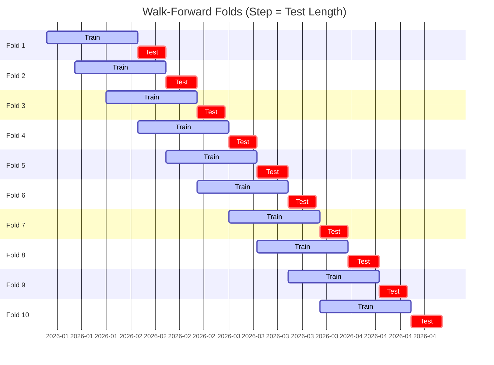

# Trading Strategy Pipeline Report

**Generated**: 2026-05-07 21:00:41

## Executive Summary

**WFO Training/Test period:** n/a  
**Coins:** 6

| | WFO Full Range | YTD |
|-|----------------|--------|
| Strategy CAGR | n/a | n/a |
| BTC buy & hold CAGR | n/a | n/a |
| S&P 500 CAGR | n/a | n/a |
| Strategy Sharpe | n/a | n/a |
| Max Drawdown | n/a | n/a |
| Total Trades | 0 | n/a |
| Win Rate | n/a | n/a |

## Result Validation (Training/Test Data)
**Period: n/a** — WFO-selected parameters replayed on the full training/test range.

### Combined Portfolio Performance

| Metric | Strategy | BTC (buy & hold) | S&P 500 (SPY) |
|--------|----------|------------------|---------------|
| Total Return | n/a | n/a | n/a |
| CAGR | n/a | n/a | n/a |
| Sharpe Ratio | n/a | n/a | n/a |
| Max Drawdown | n/a | n/a | n/a |
| Total Trades | 0 | 1 | 1 |
| Win Rate | n/a | - | - |

## YTD Performance

*Not executed.*

## Per-Coin Strategy Selection (WFO)

Best performing strategy per coin based on robustness scores (highest first).

| Symbol | Strategy | Selection | Robustness Score |
|--------|----------|-----------|------------------|
| DYDX-USD | supertrend_flip+atr_trailing | wfo_robustness | 0.6866 |
| OP-USD | donchian_breakout+atr_trailing | wfo_robustness | 0.5750 |
| JTO-USD | psar_adx+atr_trailing | wfo_robustness | 0.4472 |
| JUP-USD | bbands_mean_reversion+fixed_sl_tp | wfo_robustness | 0.4309 |
| USDUC-USD | macd_cross+atr_trailing | wfo_robustness | 0.4152 |
| B3-USD | stoch_rsi_reversal+atr_trailing | wfo_robustness | 0.3074 |

### WFO Fold Timeline

### WFO Out-of-Sample Sharpe — Per Fold

Per-fold OOS Sharpe for each coin's winning strategy (folds ordered as above). Negative = strategy did not generalise.

| Symbol | Strategy+Exit | IS Rob | OOS Rob | Consistency | Fold 1 | Fold 2 | Fold 3 | Fold 4 | Fold 5 | Fold 6 | Fold 7 | Fold 8 | Fold 9 | Fold 10 |
|--------|---------------|--------|---------|-------------|--------|--------|--------|--------|--------|--------|--------|--------|--------|--------|
| OP-USD | donchian_breakout+atr_trailing | 0.0000 | 1.3142 | 50% | n/a | -1.726 | n/a | n/a | 5.533 | n/a | n/a | n/a | 4.497 | -1.979 |
| DYDX-USD | supertrend_flip+atr_trailing | 1.1984 | 0.8511 | 62% | n/a | -6.377 | -6.270 | n/a | 6.480 | 2.364 | 5.465 | -7.798 | 7.642 | 0.051 |
| USDUC-USD | macd_cross+atr_trailing | 0.9353 | 0.6373 | 43% | -7.347 | 6.268 | -0.043 | -2.914 | n/a | -6.379 | n/a | 3.542 | 5.236 | n/a |
| JTO-USD | psar_adx+atr_trailing | 1.3911 | 0.4989 | 44% | -4.391 | 0.237 | n/a | -6.289 | 9.830 | -2.071 | -6.180 | 9.723 | 2.761 | -3.018 |
| B3-USD | stoch_rsi_reversal+atr_trailing | 0.9500 | 0.3613 | 43% | n/a | -1.682 | n/a | -2.020 | -1.492 | n/a | 2.592 | 0.770 | -1.680 | 3.314 |
| JUP-USD | bbands_mean_reversion+fixed_sl_tp | 1.4695 | 0.0597 | 86% | n/a | 2.800 | 1.865 | 2.960 | n/a | n/a | 2.269 | -9.670 | 3.544 | 0.788 |

## Full-Period Performance (Per-Coin)

Performance metrics from running WFO-selected parameters on full-range data.

---

*For pipeline methodology, fold structure, and benchmark definitions see [docs/architecture.md](../../../docs/architecture.md).*

---

*Report generated by ggTrader Pipeline*