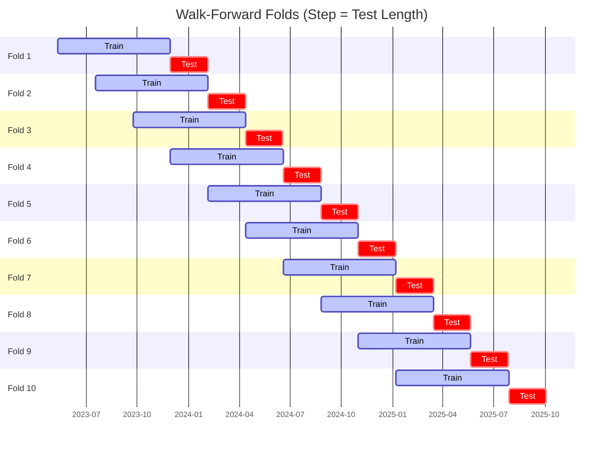

# Trading Strategy Pipeline Report

**Generated**: 2026-05-21 19:19:25

## Executive Summary

**WFO Training/Test period:** 2023-05-12 -> 2026-05-11  
**YTD performance window:** 2025-05-22 -> 2026-05-22  
**Coins:** 1

| | WFO Full Range | YTD |
|-|----------------|--------|
| Strategy CAGR | -18.53% | 7.70% |
| BTC buy & hold CAGR | 44.56% ❌ | -31.14% ✅ |
| S&P 500 CAGR | 23.05% ❌ | 28.87% ❌ |
| Strategy Sharpe | -0.14 | 0.39 |
| Max Drawdown | -65.81% | -40.96% |
| Total Trades | 99 | 33 |
| Win Rate | 26.26% | 33.33% |

## Result Validation (Training/Test Data)
**Period: 2023-05-12 -> 2026-05-11** — WFO-selected parameters replayed on the full training/test range.

### Combined Portfolio Performance

| Metric | Strategy | BTC (buy & hold) | S&P 500 (SPY) |
|--------|----------|------------------|---------------|
| Total Return | -45.89% | 201.86% | 86.23% |
| CAGR | -18.53% | 44.56% | 23.05% |
| Sharpe Ratio | -0.1405 | 1.0355 | 1.3076 |
| Max Drawdown | -65.81% | -49.89% | -14.53% |
| Total Trades | 99 | 1 | 1 |
| Win Rate | 26.26% | - | - |

## YTD Performance
**Period: 2025-05-22 -> 2026-05-22** — WFO-selected parameters replayed on the YTD window, no re-optimization.

| Metric | Strategy | BTC (buy & hold) | S&P 500 (SPY) |
|--------|----------|------------------|---------------|
| Total Return | 7.69% | -31.11% | 28.84% |
| CAGR | 7.70% | -31.14% | 28.87% |
| Sharpe Ratio | 0.3855 | -0.7154 | 2.6115 |
| Max Drawdown | -40.96% | -49.89% | -7.54% |
| Total Trades | 33 | 1 | 1 |
| Win Rate | 33.33% | - | - |

## Per-Coin Strategy Selection (WFO)

Best performing strategy per coin based on robustness scores (highest first).

| Symbol | Strategy | Selection | Robustness Score |
|--------|----------|-----------|------------------|
| DOGE-USD | donchian_breakout+trailing_stop | textbook_gates_then_sortino | -3.4061 |

### WFO Fold Timeline

### WFO Out-of-Sample Sharpe — Per Fold

Per-fold OOS Sharpe for each coin's winning strategy (folds ordered as above). Negative = strategy did not generalise.

| Symbol | Strategy+Exit | IS Rob | OOS Rob | Consistency | Fold 1 | Fold 2 | Fold 3 | Fold 4 | Fold 5 | Fold 6 | Fold 7 | Fold 8 | Fold 9 | Fold 10 |
|--------|---------------|--------|---------|-------------|--------|--------|--------|--------|--------|--------|--------|--------|--------|--------|
| DOGE-USD | donchian_breakout+trailing_stop | -3.4061 | 1.3870 | 60% | -2.598 | 1.966 | -0.673 | -0.575 | 2.143 | 3.982 | -1.161 | 0.090 | 3.009 | 0.799 |

## Full-Period Performance (Per-Coin)

Performance metrics from running WFO-selected parameters on full-range data.

| Symbol | Strategy | Exit | Selection | Return % | Sharpe | Max DD % | Trades | Win Rate % |
|--------|----------|------|-----------|----------|--------|----------|--------|-----------|
| DOGE-USD | donchian_breakout | trailing_stop | textbook_gates_then_sortino | -1.90% | -0.0848 | -9.22% | 100 | 26.00% |

---

*For pipeline methodology, fold structure, and benchmark definitions see [docs/architecture.md](../../../docs/architecture.md).*

---

*Report generated by ggTrader Pipeline*