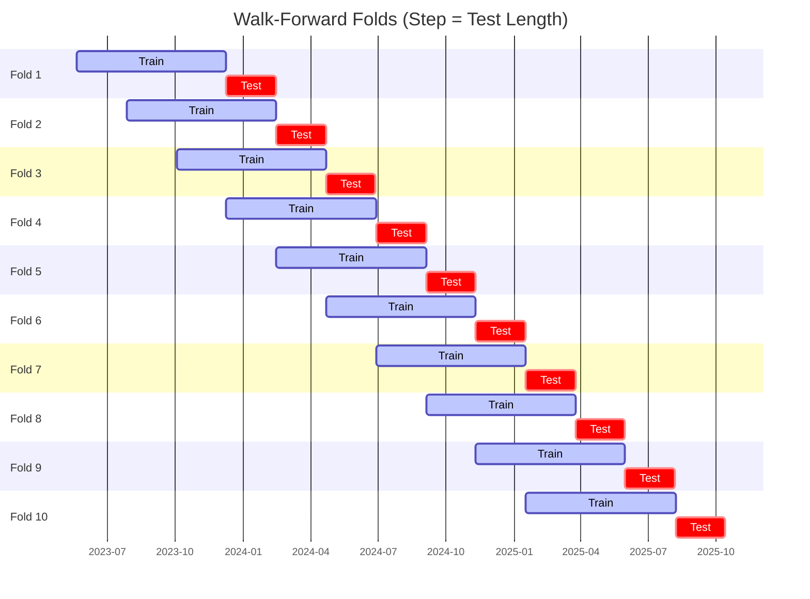

# Trading Strategy Pipeline Report

**Generated**: 2026-05-21 23:00:19

## Executive Summary

**WFO Training/Test period:** 2023-05-22 -> 2026-05-21  
**YTD performance window:** 2025-05-22 -> 2026-05-22  
**Coins:** 1

| | WFO Full Range | YTD |
|-|----------------|--------|
| Strategy CAGR | -1.03% | -52.37% |
| BTC buy & hold CAGR | 42.18% ❌ | -31.14% ❌ |
| S&P 500 CAGR | 22.54% ❌ | 29.76% ❌ |
| Strategy Sharpe | 0.27 | -1.66 |
| Max Drawdown | -78.85% | -58.93% |
| Total Trades | 73 | 25 |
| Win Rate | 36.99% | 20.00% |

## Result Validation (Training/Test Data)
**Period: 2023-05-22 -> 2026-05-21** — WFO-selected parameters replayed on the full training/test range.

### Combined Portfolio Performance

| Metric | Strategy | BTC (buy & hold) | S&P 500 (SPY) |
|--------|----------|------------------|---------------|
| Total Return | -3.06% | 187.21% | 83.93% |
| CAGR | -1.03% | 42.18% | 22.54% |
| Sharpe Ratio | 0.2748 | 0.9985 | 1.2824 |
| Max Drawdown | -78.85% | -49.89% | -14.53% |
| Total Trades | 73 | 1 | 1 |
| Win Rate | 36.99% | - | - |

## YTD Performance
**Period: 2025-05-22 -> 2026-05-22** — WFO-selected parameters replayed on the YTD window, no re-optimization.

| Metric | Strategy | BTC (buy & hold) | S&P 500 (SPY) |
|--------|----------|------------------|---------------|
| Total Return | -52.33% | -31.11% | 29.72% |
| CAGR | -52.37% | -31.14% | 29.76% |
| Sharpe Ratio | -1.6562 | -0.7153 | 2.6871 |
| Max Drawdown | -58.93% | -49.89% | -7.54% |
| Total Trades | 25 | 1 | 1 |
| Win Rate | 20.00% | - | - |

## Per-Coin Strategy Selection (WFO)

Best performing strategy per coin based on robustness scores (highest first).

| Symbol | Strategy | Selection | Robustness Score |
|--------|----------|-----------|------------------|
| SOL-USD | macd_cross+atr_trailing | textbook_gates_then_sortino | -3.0727 |

### WFO Fold Timeline

### WFO Out-of-Sample Sharpe — Per Fold

Per-fold OOS Sharpe for each coin's winning strategy (folds ordered as above). Negative = strategy did not generalise.

| Symbol | Strategy+Exit | IS Rob | OOS Rob | Consistency | Fold 1 | Fold 2 | Fold 3 | Fold 4 | Fold 5 | Fold 6 | Fold 7 | Fold 8 | Fold 9 | Fold 10 |
|--------|---------------|--------|---------|-------------|--------|--------|--------|--------|--------|--------|--------|--------|--------|--------|
| SOL-USD | macd_cross+atr_trailing | -3.0727 | 0.5893 | 70% | 2.637 | 1.327 | -3.627 | -0.726 | 4.584 | 0.057 | -5.224 | 1.575 | 0.428 | 1.017 |

## Full-Period Performance (Per-Coin)

Performance metrics from running WFO-selected parameters on full-range data.

| Symbol | Strategy | Exit | Selection | Return % | Sharpe | Max DD % | Trades | Win Rate % |
|--------|----------|------|-----------|----------|--------|----------|--------|-----------|
| SOL-USD | macd_cross | atr_trailing | textbook_gates_then_sortino | 4.74% | 0.2685 | -13.20% | 73 | 36.99% |

---

*For pipeline methodology, fold structure, and benchmark definitions see [docs/architecture.md](../../../docs/architecture.md).*

---

*Report generated by ggTrader Pipeline*