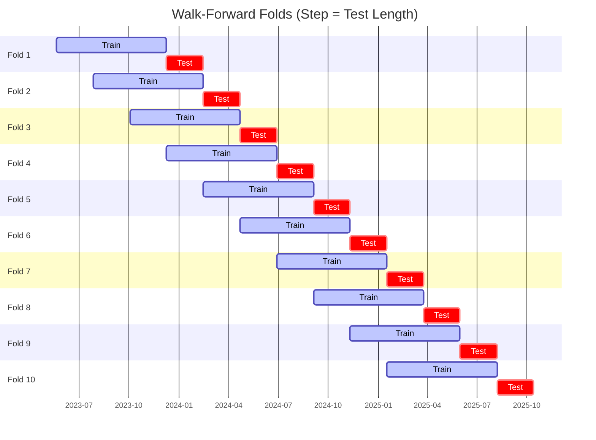

# Trading Strategy Pipeline Report

**Generated**: 2026-05-22 02:22:32

## Executive Summary

**WFO Training/Test period:** 2023-05-22 -> 2026-05-21  
**YTD performance window:** 2025-05-22 -> 2026-05-22  
**Coins:** 4

| | WFO Full Range | YTD |
|-|----------------|--------|
| Strategy CAGR | 23.90% | 5.76% |
| BTC buy & hold CAGR | 42.54% ❌ | -30.65% ✅ |
| S&P 500 CAGR | 22.54% ✅ | 29.76% ❌ |
| Strategy Sharpe | 0.85 | 0.33 |
| Max Drawdown | -30.77% | -30.77% |
| Total Trades | 291 | 113 |
| Win Rate | 41.58% | 38.05% |

## Result Validation (Training/Test Data)
**Period: 2023-05-22 -> 2026-05-21** — WFO-selected parameters replayed on the full training/test range.

### Combined Portfolio Performance

| Metric | Strategy | BTC (buy & hold) | S&P 500 (SPY) |
|--------|----------|------------------|---------------|
| Total Return | 90.13% | 189.40% | 83.93% |
| CAGR | 23.90% | 42.54% | 22.54% |
| Sharpe Ratio | 0.8451 | 1.0041 | 1.2824 |
| Max Drawdown | -30.77% | -49.89% | -14.53% |
| Total Trades | 291 | 1 | 1 |
| Win Rate | 41.58% | - | - |

## YTD Performance
**Period: 2025-05-22 -> 2026-05-22** — WFO-selected parameters replayed on the YTD window, no re-optimization.

| Metric | Strategy | BTC (buy & hold) | S&P 500 (SPY) |
|--------|----------|------------------|---------------|
| Total Return | 5.75% | -30.62% | 29.72% |
| CAGR | 5.76% | -30.65% | 29.76% |
| Sharpe Ratio | 0.3337 | -0.6981 | 2.6871 |
| Max Drawdown | -30.77% | -49.89% | -7.54% |
| Total Trades | 113 | 1 | 1 |
| Win Rate | 38.05% | - | - |

## Per-Coin Strategy Selection (WFO)

Best performing strategy per coin based on robustness scores (highest first).

| Symbol | Strategy | Selection | Robustness Score |
|--------|----------|-----------|------------------|
| NEAR-USD | donchian_breakout+trailing_stop | textbook_gates_then_sortino | -2.2667 |
| ICP-USD | macd_cross+atr_trailing | textbook_gates_then_sortino | -2.6545 |
| ZEC-USD | donchian_breakout+trailing_stop | textbook_gates_then_sortino | -3.0000 |
| TRX-USD | bbands_mean_reversion+trailing_stop | textbook_gates_then_sortino | -3.4394 |

### WFO Fold Timeline

### WFO Out-of-Sample Sharpe — Per Fold

Per-fold OOS Sharpe for each coin's winning strategy (folds ordered as above). Negative = strategy did not generalise.

| Symbol | Strategy+Exit | IS Rob | OOS Rob | Consistency | Fold 1 | Fold 2 | Fold 3 | Fold 4 | Fold 5 | Fold 6 | Fold 7 | Fold 8 | Fold 9 | Fold 10 |
|--------|---------------|--------|---------|-------------|--------|--------|--------|--------|--------|--------|--------|--------|--------|--------|
| NEAR-USD | donchian_breakout+trailing_stop | -2.2667 | 1.3089 | 60% | 3.031 | 1.254 | 0.727 | 1.891 | 4.737 | -1.675 | -3.350 | 0.831 | -1.870 | -0.304 |
| ZEC-USD | donchian_breakout+trailing_stop | -3.0000 | 0.9861 | 70% | 0.273 | 0.797 | -1.510 | 0.002 | -0.039 | 2.547 | 1.813 | 0.387 | -2.566 | 2.859 |
| TRX-USD | bbands_mean_reversion+trailing_stop | -3.4394 | 0.6833 | 60% | 2.246 | -1.710 | 0.773 | 0.313 | -0.348 | 1.922 | -0.000 | -2.747 | 0.322 | 2.094 |
| ICP-USD | macd_cross+atr_trailing | -2.6545 | 0.4816 | 60% | 2.563 | 1.714 | -5.447 | 2.949 | 1.817 | 1.222 | 0.342 | -1.960 | -0.065 | -2.883 |

## Full-Period Performance (Per-Coin)

Performance metrics from running WFO-selected parameters on full-range data.

| Symbol | Strategy | Exit | Selection | Return % | Sharpe | Max DD % | Trades | Win Rate % |
|--------|----------|------|-----------|----------|--------|----------|--------|-----------|
| TRX-USD | bbands_mean_reversion | trailing_stop | textbook_gates_then_sortino | 8.05% | 0.6651 | -4.21% | 93 | 45.16% |
| ZEC-USD | donchian_breakout | trailing_stop | textbook_gates_then_sortino | 10.89% | 0.5224 | -8.86% | 104 | 39.42% |
| NEAR-USD | donchian_breakout | trailing_stop | textbook_gates_then_sortino | 6.19% | 0.3755 | -8.43% | 97 | 39.18% |

---

*For pipeline methodology, fold structure, and benchmark definitions see [docs/architecture.md](../../../docs/architecture.md).*

---

*Report generated by ggTrader Pipeline*