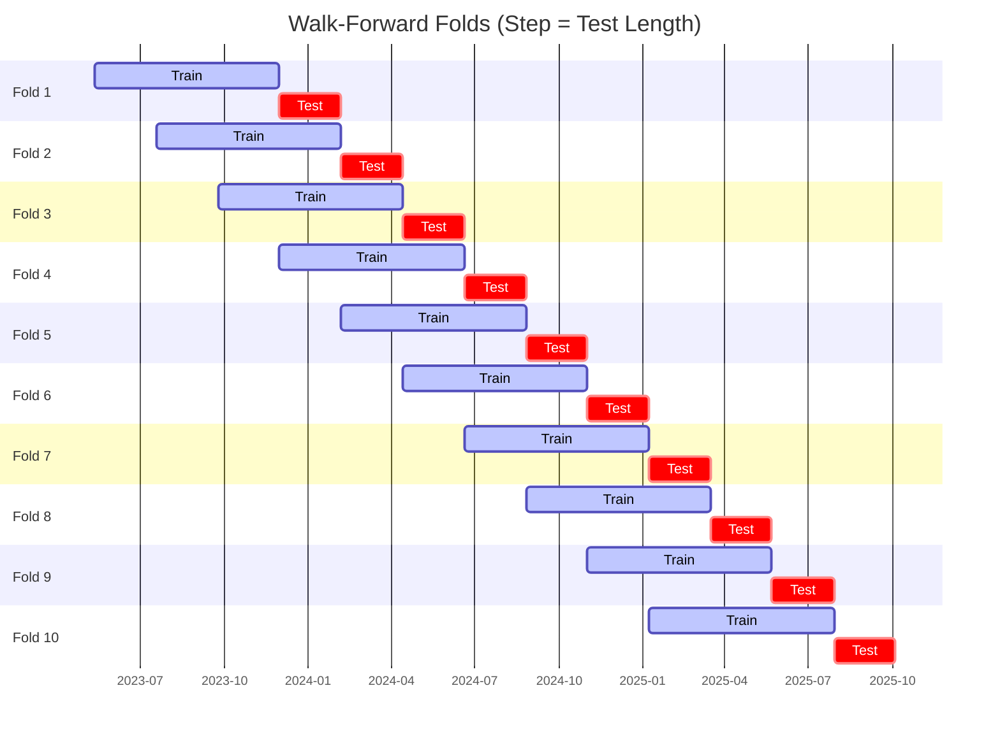

# Trading Strategy Pipeline Report

**Generated**: 2026-05-22 16:13:04

## Executive Summary

**WFO Training/Test period:** 2023-05-13 -> 2026-05-12  
**YTD performance window:** 2025-05-23 -> 2026-05-22  
**Coins:** 4

| | WFO Full Range | YTD |
|-|----------------|--------|
| Strategy CAGR | 14.80% | 6.21% |
| BTC buy & hold CAGR | 44.30% ❌ | -32.28% ✅ |
| S&P 500 CAGR | 23.00% ❌ | 30.27% ❌ |
| Strategy Sharpe | 0.72 | 0.37 |
| Max Drawdown | -22.33% | -25.67% |
| Total Trades | 355 | 143 |
| Win Rate | 35.49% | 35.66% |

## Result Validation (Training/Test Data)
**Period: 2023-05-13 -> 2026-05-12** — WFO-selected parameters replayed on the full training/test range.

### Combined Portfolio Performance

| Metric | Strategy | BTC (buy & hold) | S&P 500 (SPY) |
|--------|----------|------------------|---------------|
| Total Return | 51.26% | 200.25% | 86.01% |
| CAGR | 14.80% | 44.30% | 23.00% |
| Sharpe Ratio | 0.7234 | 1.0314 | 1.3053 |
| Max Drawdown | -22.33% | -49.89% | -14.53% |
| Total Trades | 355 | 1 | 1 |
| Win Rate | 35.49% | - | - |

## YTD Performance
**Period: 2025-05-23 -> 2026-05-22** — WFO-selected parameters replayed on the YTD window, no re-optimization.

| Metric | Strategy | BTC (buy & hold) | S&P 500 (SPY) |
|--------|----------|------------------|---------------|
| Total Return | 6.20% | -32.25% | 30.23% |
| CAGR | 6.21% | -32.28% | 30.27% |
| Sharpe Ratio | 0.3668 | -0.7561 | 2.7249 |
| Max Drawdown | -25.67% | -49.89% | -7.54% |
| Total Trades | 143 | 1 | 1 |
| Win Rate | 35.66% | - | - |

## Per-Coin Strategy Selection (WFO)

Best performing strategy per coin based on robustness scores (highest first).

| Symbol | Strategy | Selection | Robustness Score |
|--------|----------|-----------|------------------|
| TRX-USD | stoch_rsi_reversal+atr_trailing | textbook_gates_then_sortino | -1.9939 |
| ZEC-USD | donchian_breakout+trailing_stop | textbook_gates_then_sortino | -2.8606 |
| DOGE-USD | donchian_breakout+trailing_stop | textbook_gates_then_sortino | -3.2909 |
| BTC-USD | bbands_mean_reversion+atr_trailing | textbook_gates_then_sortino | -4.3242 |

### WFO Fold Timeline

### WFO Out-of-Sample Sharpe — Per Fold

Per-fold OOS Sharpe for each coin's winning strategy (folds ordered as above). Negative = strategy did not generalise.

| Symbol | Strategy+Exit | IS Rob | OOS Rob | Consistency | Fold 1 | Fold 2 | Fold 3 | Fold 4 | Fold 5 | Fold 6 | Fold 7 | Fold 8 | Fold 9 | Fold 10 |
|--------|---------------|--------|---------|-------------|--------|--------|--------|--------|--------|--------|--------|--------|--------|--------|
| TRX-USD | stoch_rsi_reversal+atr_trailing | -1.9939 | 1.9094 | 70% | 2.259 | 0.650 | -0.915 | 2.613 | -1.186 | 1.359 | -1.126 | 2.388 | 3.038 | 3.074 |
| DOGE-USD | donchian_breakout+trailing_stop | -3.2909 | 1.6728 | 60% | -3.139 | 2.293 | -0.162 | -0.481 | 2.204 | 3.564 | -0.833 | 1.313 | 3.364 | 0.627 |
| BTC-USD | bbands_mean_reversion+atr_trailing | -4.3242 | 1.4236 | 60% | -0.972 | 3.385 | -3.637 | -0.108 | 1.579 | 3.156 | 0.680 | 3.747 | -0.165 | 0.558 |
| ZEC-USD | donchian_breakout+trailing_stop | -2.8606 | 1.2692 | 70% | 0.202 | 1.201 | -0.478 | -0.195 | 0.159 | 1.148 | 2.080 | 2.369 | -2.259 | 2.314 |

## Full-Period Performance (Per-Coin)

Performance metrics from running WFO-selected parameters on full-range data.

| Symbol | Strategy | Exit | Selection | Return % | Sharpe | Max DD % | Trades | Win Rate % |
|--------|----------|------|-----------|----------|--------|----------|--------|-----------|
| TRX-USD | stoch_rsi_reversal | atr_trailing | textbook_gates_then_sortino | 6.08% | 0.5123 | -4.92% | 78 | 34.62% |
| ZEC-USD | donchian_breakout | trailing_stop | textbook_gates_then_sortino | 7.74% | 0.3852 | -8.86% | 106 | 38.68% |
| DOGE-USD | donchian_breakout | trailing_stop | textbook_gates_then_sortino | 5.83% | 0.3644 | -7.05% | 100 | 32.00% |
| BTC-USD | bbands_mean_reversion | atr_trailing | trade_freq_fallback | 0.39% | 0.0576 | -5.08% | 76 | 34.21% |

---

*For pipeline methodology, fold structure, and benchmark definitions see [docs/architecture.md](../../../docs/architecture.md).*

---

*Report generated by ggTrader Pipeline*