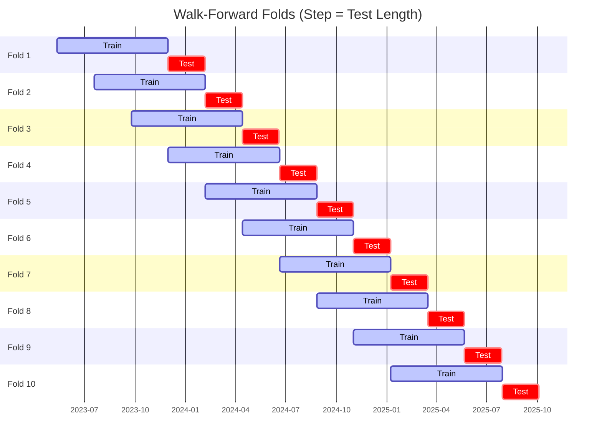

# Trading Strategy Pipeline Report

**Generated**: 2026-05-22 17:57:06

## Executive Summary

**WFO Training/Test period:** 2023-05-13 -> 2026-05-12  
**YTD performance window:** 2025-05-23 -> 2026-05-23  
**Coins:** 1

| | WFO Full Range | YTD |
|-|----------------|--------|
| Strategy CAGR | -18.55% | -48.17% |
| BTC buy & hold CAGR | 43.94% ❌ | -32.95% ❌ |
| S&P 500 CAGR | 23.00% ❌ | 30.27% ❌ |
| Strategy Sharpe | -0.56 | -2.58 |
| Max Drawdown | -59.92% | -50.40% |
| Total Trades | 75 | 26 |
| Win Rate | 28.00% | 19.23% |

## Result Validation (Training/Test Data)
**Period: 2023-05-13 -> 2026-05-12** — WFO-selected parameters replayed on the full training/test range.

### Combined Portfolio Performance

| Metric | Strategy | BTC (buy & hold) | S&P 500 (SPY) |
|--------|----------|------------------|---------------|
| Total Return | -45.93% | 197.97% | 86.01% |
| CAGR | -18.55% | 43.94% | 23.00% |
| Sharpe Ratio | -0.5563 | 1.0258 | 1.3053 |
| Max Drawdown | -59.92% | -49.89% | -14.53% |
| Total Trades | 75 | 1 | 1 |
| Win Rate | 28.00% | - | - |

## YTD Performance
**Period: 2025-05-23 -> 2026-05-23** — WFO-selected parameters replayed on the YTD window, no re-optimization.

| Metric | Strategy | BTC (buy & hold) | S&P 500 (SPY) |
|--------|----------|------------------|---------------|
| Total Return | -48.13% | -32.92% | 30.23% |
| CAGR | -48.17% | -32.95% | 30.27% |
| Sharpe Ratio | -2.5830 | -0.7801 | 2.7249 |
| Max Drawdown | -50.40% | -49.89% | -7.54% |
| Total Trades | 26 | 1 | 1 |
| Win Rate | 19.23% | - | - |

## Per-Coin Strategy Selection (WFO)

Best performing strategy per coin based on robustness scores (highest first).

| Symbol | Strategy | Selection | Robustness Score |
|--------|----------|-----------|------------------|
| BTC-USD | bbands_mean_reversion+atr_trailing | textbook_gates_then_sortino | -4.3242 |

### WFO Fold Timeline

### WFO Out-of-Sample Sharpe — Per Fold

Per-fold OOS Sharpe for each coin's winning strategy (folds ordered as above). Negative = strategy did not generalise.

| Symbol | Strategy+Exit | IS Rob | OOS Rob | Consistency | Fold 1 | Fold 2 | Fold 3 | Fold 4 | Fold 5 | Fold 6 | Fold 7 | Fold 8 | Fold 9 | Fold 10 |
|--------|---------------|--------|---------|-------------|--------|--------|--------|--------|--------|--------|--------|--------|--------|--------|
| BTC-USD | bbands_mean_reversion+atr_trailing | -4.3242 | 0.8580 | 60% | -1.816 | 3.358 | -4.467 | -0.147 | 0.790 | 2.681 | 0.414 | 3.700 | -0.845 | 0.485 |

## Full-Period Performance (Per-Coin)

Performance metrics from running WFO-selected parameters on full-range data.

| Symbol | Strategy | Exit | Selection | Return % | Sharpe | Max DD % | Trades | Win Rate % |
|--------|----------|------|-----------|----------|--------|----------|--------|-----------|
| BTC-USD | bbands_mean_reversion | atr_trailing | trade_freq_fallback | -5.23% | -0.5696 | -8.06% | 76 | 27.63% |

---

*For pipeline methodology, fold structure, and benchmark definitions see [docs/architecture.md](../../../docs/architecture.md).*

---

*Report generated by ggTrader Pipeline*