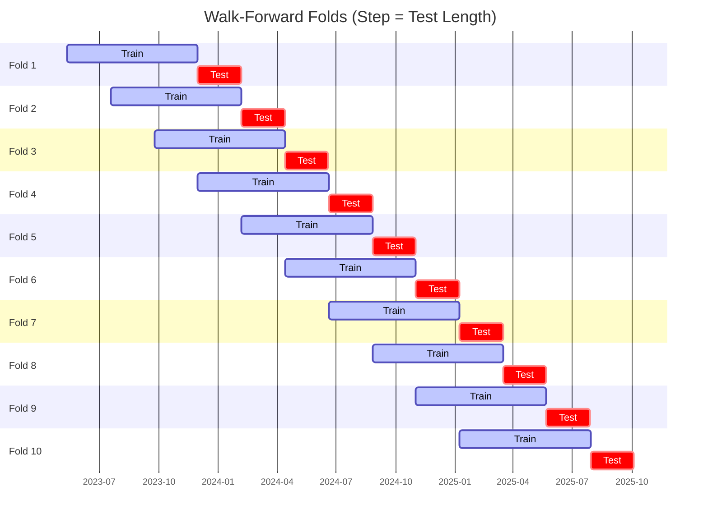

# Trading Strategy Pipeline Report

**Generated**: 2026-05-23 00:23:43

## Executive Summary

**WFO Training/Test period:** 2023-05-13 -> 2026-05-12  
**YTD performance window:** 2025-05-23 -> 2026-05-23  
**Coins:** 5

| | WFO Full Range | YTD |
|-|----------------|--------|
| Strategy CAGR | -6.62% | 1.92% |
| BTC buy & hold CAGR | 44.84% ❌ | -31.27% ✅ |
| S&P 500 CAGR | 23.00% ❌ | 27.62% ❌ |
| Strategy Sharpe | -0.09 | 0.20 |
| Max Drawdown | -43.09% | -24.56% |
| Total Trades | 318 | 88 |
| Win Rate | 30.82% | 39.77% |

## Result Validation (Training/Test Data)
**Period: 2023-05-13 -> 2026-05-12** — WFO-selected parameters replayed on the full training/test range.

### Combined Portfolio Performance

| Metric | Strategy | BTC (buy & hold) | S&P 500 (SPY) |
|--------|----------|------------------|---------------|
| Total Return | -18.56% | 203.63% | 86.01% |
| CAGR | -6.62% | 44.84% | 23.00% |
| Sharpe Ratio | -0.0897 | 1.0397 | 1.3053 |
| Max Drawdown | -43.09% | -49.89% | -14.53% |
| Total Trades | 318 | 1 | 1 |
| Win Rate | 30.82% | - | - |

## YTD Performance
**Period: 2025-05-23 -> 2026-05-23** — WFO-selected parameters replayed on the YTD window, no re-optimization.

| Metric | Strategy | BTC (buy & hold) | S&P 500 (SPY) |
|--------|----------|------------------|---------------|
| Total Return | 1.91% | -31.24% | 27.58% |
| CAGR | 1.92% | -31.27% | 27.62% |
| Sharpe Ratio | 0.2018 | -0.7205 | 2.5713 |
| Max Drawdown | -24.56% | -49.89% | -7.54% |
| Total Trades | 88 | 1 | 1 |
| Win Rate | 39.77% | - | - |

## Per-Coin Strategy Selection (WFO)

Best performing strategy per coin based on robustness scores (highest first).

| Symbol | Strategy | Selection | Robustness Score |
|--------|----------|-----------|------------------|
| ETH-USD | adx_filtered_rsi+trailing_stop | textbook_gates_then_sortino | 0.0000 |
| BTC-USD | bbands_mean_reversion+atr_trailing | textbook_gates_then_sortino | -2.8273 |
| ZEC-USD | donchian_breakout+trailing_stop | textbook_gates_then_sortino | -2.8606 |
| DOGE-USD | ema_cross+trailing_stop | textbook_gates_then_sortino | -6.8519 |
| SUI-USD | rsi_reversal+atr_trailing | textbook_gates_then_sortino | -12.7067 |

### WFO Fold Timeline

### WFO Out-of-Sample Sharpe — Per Fold

Per-fold OOS Sharpe for each coin's winning strategy (folds ordered as above). Negative = strategy did not generalise.

| Symbol | Strategy+Exit | IS Rob | OOS Rob | Consistency | Fold 1 | Fold 2 | Fold 3 | Fold 4 | Fold 5 | Fold 6 | Fold 7 | Fold 8 | Fold 9 | Fold 10 |
|--------|---------------|--------|---------|-------------|--------|--------|--------|--------|--------|--------|--------|--------|--------|--------|
| ZEC-USD | donchian_breakout+trailing_stop | -2.8606 | 1.7077 | 80% | 1.517 | 1.203 | -3.945 | 0.267 | 0.307 | 0.856 | 1.726 | 2.372 | -0.815 | 3.667 |
| DOGE-USD | ema_cross+trailing_stop | -6.8519 | 1.6728 | 60% | -3.139 | 2.293 | -0.162 | -0.481 | 2.204 | 3.564 | -0.833 | 1.313 | 3.364 | 0.627 |
| BTC-USD | bbands_mean_reversion+atr_trailing | -2.8273 | 1.4236 | 60% | -0.972 | 3.385 | -3.637 | -0.108 | 1.579 | 3.156 | 0.680 | 3.747 | -0.165 | 0.558 |
| SUI-USD | rsi_reversal+atr_trailing | -12.7067 | 0.6395 | 60% | 1.715 | -1.532 | -1.096 | 2.605 | 3.480 | 1.244 | -4.453 | 1.337 | 1.030 | -3.524 |
| ETH-USD | adx_filtered_rsi+trailing_stop | 0.0000 | 0.0677 | 60% | 0.027 | 0.769 | 1.287 | -1.474 | -4.219 | 2.839 | -2.938 | -2.906 | 2.374 | 2.385 |

## Full-Period Performance (Per-Coin)

Performance metrics from running WFO-selected parameters on full-range data.

| Symbol | Strategy | Exit | Selection | Return % | Sharpe | Max DD % | Trades | Win Rate % |
|--------|----------|------|-----------|----------|--------|----------|--------|-----------|
| DOGE-USD | ema_cross | trailing_stop | textbook_gates_then_sortino | 5.83% | 0.3644 | -7.05% | 100 | 32.00% |
| BTC-USD | bbands_mean_reversion | atr_trailing | textbook_gates_then_sortino | 0.00% | 0.0000 | 0.00% | 0 | 0.00% |
| SUI-USD | rsi_reversal | atr_trailing | textbook_gates_then_sortino | -4.91% | -0.2411 | -11.70% | 125 | 28.80% |
| ETH-USD | adx_filtered_rsi | trailing_stop | textbook_gates_then_sortino | -2.58% | -0.2552 | -6.57% | 96 | 31.25% |

---

*For pipeline methodology, fold structure, and benchmark definitions see [docs/architecture.md](../../../docs/architecture.md).*

---

*Report generated by ggTrader Pipeline*