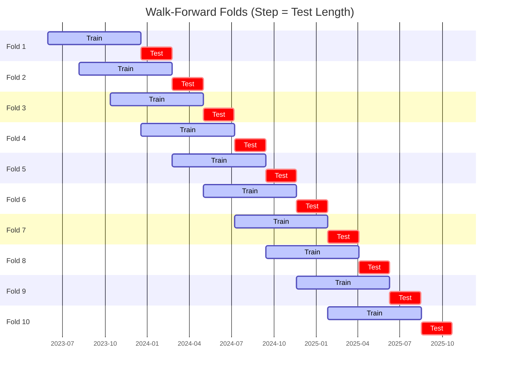

# Trading Strategy Pipeline Report

**Generated**: 2026-05-31 23:27:51

## Executive Summary

**WFO Training/Test period:** 2023-05-31 -> 2026-05-30  
**YTD performance window:** 2025-06-01 -> 2026-06-01  
**Coins:** 2

| | WFO Full Range | YTD |
|-|----------------|--------|
| Strategy CAGR | 22.52% | -24.08% |
| BTC buy & hold CAGR | 38.20% ❌ | -29.82% ✅ |
| S&P 500 CAGR | 23.47% ❌ | 29.13% ❌ |
| Strategy Sharpe | 0.66 | -0.88 |
| Max Drawdown | -51.04% | -27.54% |
| Total Trades | 228 | 50 |
| Win Rate | 33.77% | 36.00% |

## Result Validation (Training/Test Data)
**Period: 2023-05-31 -> 2026-05-30** — WFO-selected parameters replayed on the full training/test range.

### Combined Portfolio Performance

| Metric | Strategy | BTC (buy & hold) | S&P 500 (SPY) |
|--------|----------|------------------|---------------|
| Total Return | 83.82% | 163.77% | 88.13% |
| CAGR | 22.52% | 38.20% | 23.47% |
| Sharpe Ratio | 0.6587 | 0.9367 | 1.3294 |
| Max Drawdown | -51.04% | -49.89% | -14.53% |
| Total Trades | 228 | 1 | 1 |
| Win Rate | 33.77% | - | - |

## YTD Performance
**Period: 2025-06-01 -> 2026-06-01** — WFO-selected parameters replayed on the YTD window, no re-optimization.

| Metric | Strategy | BTC (buy & hold) | S&P 500 (SPY) |
|--------|----------|------------------|---------------|
| Total Return | -24.05% | -29.79% | 29.09% |
| CAGR | -24.08% | -29.82% | 29.13% |
| Sharpe Ratio | -0.8788 | -0.6721 | 2.6941 |
| Max Drawdown | -27.54% | -49.89% | -7.54% |
| Total Trades | 50 | 1 | 1 |
| Win Rate | 36.00% | - | - |

## Per-Coin Strategy Selection (WFO)

Best performing strategy per coin based on robustness scores (highest first).

| Symbol | Strategy | Selection | Robustness Score |
|--------|----------|-----------|------------------|
| PEPE-USD | rsi_reversal+trailing_stop | textbook_gates_then_sortino | -3.6000 |
| ETH-USD | rsi_reversal+atr_trailing | textbook_gates_then_sortino | -5.2540 |

### WFO Fold Timeline

### WFO Out-of-Sample Sharpe — Per Fold

Per-fold OOS Sharpe for each coin's winning strategy (folds ordered as above). Negative = strategy did not generalise.

| Symbol | Strategy+Exit | IS Rob | OOS Rob | Consistency | Fold 1 | Fold 2 | Fold 3 | Fold 4 | Fold 5 | Fold 6 | Fold 7 | Fold 8 | Fold 9 | Fold 10 |
|--------|---------------|--------|---------|-------------|--------|--------|--------|--------|--------|--------|--------|--------|--------|--------|
| PEPE-USD | rsi_reversal+trailing_stop | -3.6000 | 1.3558 | 70% | 1.293 | 3.300 | 2.066 | -0.772 | 3.118 | 0.188 | -4.021 | 1.894 | 1.163 | -2.063 |
| ETH-USD | rsi_reversal+atr_trailing | -5.2540 | 1.0419 | 60% | 2.990 | -1.595 | 1.908 | -2.978 | 3.202 | -1.749 | -6.124 | 0.534 | 4.446 | 1.103 |

## Full-Period Performance (Per-Coin)

Performance metrics from running WFO-selected parameters on full-range data.

| Symbol | Strategy | Exit | Selection | Return % | Sharpe | Max DD % | Trades | Win Rate % |
|--------|----------|------|-----------|----------|--------|----------|--------|-----------|
| PEPE-USD | rsi_reversal | trailing_stop | textbook_gates_then_sortino | 25.76% | 0.7397 | -10.20% | 135 | 34.81% |
| ETH-USD | rsi_reversal | atr_trailing | textbook_gates_then_sortino | -2.33% | -0.2267 | -6.57% | 100 | 31.00% |

---

*For pipeline methodology, fold structure, and benchmark definitions see [docs/architecture.md](../../../docs/architecture.md).*

---

*Report generated by ggTrader Pipeline*