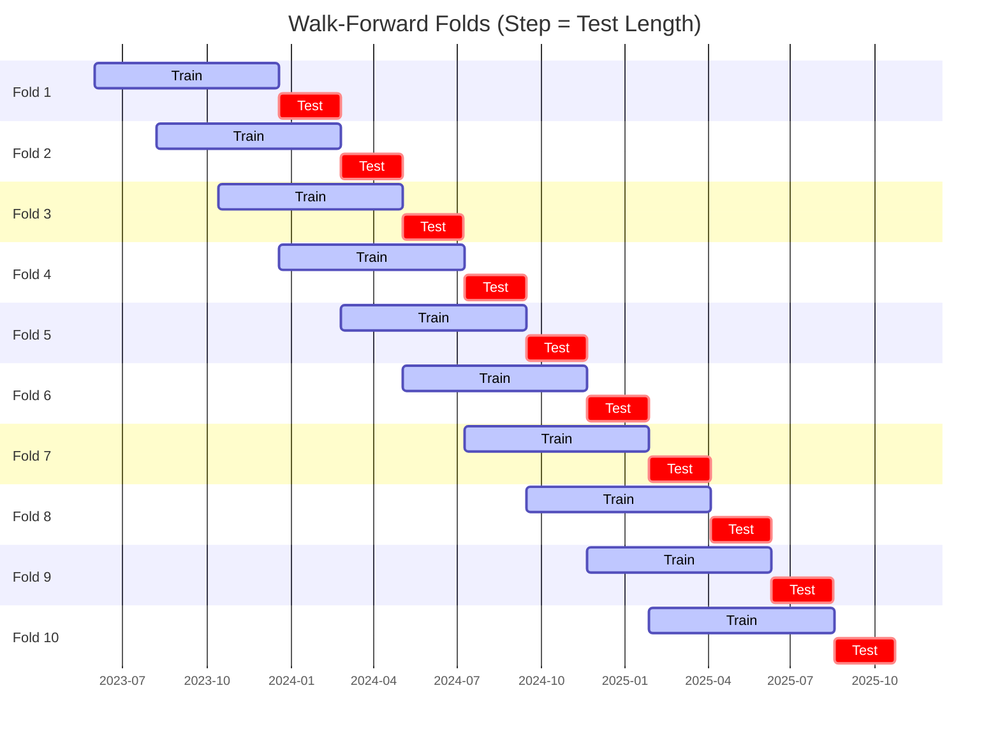

# Trading Strategy Pipeline Report

**Generated**: 2026-06-01 16:00:34

## Executive Summary

**WFO Training/Test period:** 2023-06-01 -> 2026-05-31  
**YTD performance window:** 2025-06-02 -> 2026-06-01  
**Coins:** 2

| | WFO Full Range | YTD |
|-|----------------|--------|
| Strategy CAGR | 30.61% | -44.03% |
| BTC buy & hold CAGR | 40.00% ❌ | -32.78% ❌ |
| S&P 500 CAGR | 23.08% ✅ | 29.02% ❌ |
| Strategy Sharpe | 0.73 | -0.85 |
| Max Drawdown | -75.04% | -48.68% |
| Total Trades | 132 | 23 |
| Win Rate | 35.61% | 34.78% |

## Result Validation (Training/Test Data)
**Period: 2023-06-01 -> 2026-05-31** — WFO-selected parameters replayed on the full training/test range.

### Combined Portfolio Performance

| Metric | Strategy | BTC (buy & hold) | S&P 500 (SPY) |
|--------|----------|------------------|---------------|
| Total Return | 122.68% | 174.23% | 86.36% |
| CAGR | 30.61% | 40.00% | 23.08% |
| Sharpe Ratio | 0.7283 | 0.9654 | 1.3113 |
| Max Drawdown | -75.04% | -49.89% | -14.53% |
| Total Trades | 132 | 1 | 1 |
| Win Rate | 35.61% | - | - |

## YTD Performance
**Period: 2025-06-02 -> 2026-06-01** — WFO-selected parameters replayed on the YTD window, no re-optimization.

| Metric | Strategy | BTC (buy & hold) | S&P 500 (SPY) |
|--------|----------|------------------|---------------|
| Total Return | -43.99% | -32.75% | 28.98% |
| CAGR | -44.03% | -32.78% | 29.02% |
| Sharpe Ratio | -0.8490 | -0.7769 | 2.6848 |
| Max Drawdown | -48.68% | -49.89% | -7.54% |
| Total Trades | 23 | 1 | 1 |
| Win Rate | 34.78% | - | - |

## Per-Coin Strategy Selection (WFO)

Best performing strategy per coin based on robustness scores (highest first).

| Symbol | Strategy | Selection | Robustness Score |
|--------|----------|-----------|------------------|
| BTC-USD | bbands_mean_reversion+atr_trailing | textbook_gates_then_sortino | -3.6879 |
| PEPE-USD | rsi_reversal+trailing_stop | textbook_gates_then_sortino | -3.9818 |

### WFO Fold Timeline

### WFO Out-of-Sample Sharpe — Per Fold

Per-fold OOS Sharpe for each coin's winning strategy (folds ordered as above). Negative = strategy did not generalise.

| Symbol | Strategy+Exit | IS Rob | OOS Rob | Consistency | Fold 1 | Fold 2 | Fold 3 | Fold 4 | Fold 5 | Fold 6 | Fold 7 | Fold 8 | Fold 9 | Fold 10 |
|--------|---------------|--------|---------|-------------|--------|--------|--------|--------|--------|--------|--------|--------|--------|--------|
| BTC-USD | bbands_mean_reversion+atr_trailing | -3.6879 | 1.0798 | 70% | 2.168 | 0.375 | -1.478 | 0.445 | 3.824 | 0.368 | -2.184 | 2.506 | -1.525 | 1.691 |
| PEPE-USD | rsi_reversal+trailing_stop | -3.9818 | 0.8089 | 60% | 0.288 | 2.859 | 1.137 | -1.667 | 2.975 | -0.564 | -2.352 | 0.953 | 1.251 | -1.337 |

## Full-Period Performance (Per-Coin)

Performance metrics from running WFO-selected parameters on full-range data.

| Symbol | Strategy | Exit | Selection | Return % | Sharpe | Max DD % | Trades | Win Rate % |
|--------|----------|------|-----------|----------|--------|----------|--------|-----------|
| PEPE-USD | rsi_reversal | trailing_stop | textbook_gates_then_sortino | 25.76% | 0.7397 | -10.20% | 135 | 34.81% |
| BTC-USD | bbands_mean_reversion | atr_trailing | textbook_gates_then_sortino | 0.00% | 0.0000 | 0.00% | 0 | 0.00% |

---

*For pipeline methodology, fold structure, and benchmark definitions see [docs/architecture.md](../../../docs/architecture.md).*

---

*Report generated by ggTrader Pipeline*