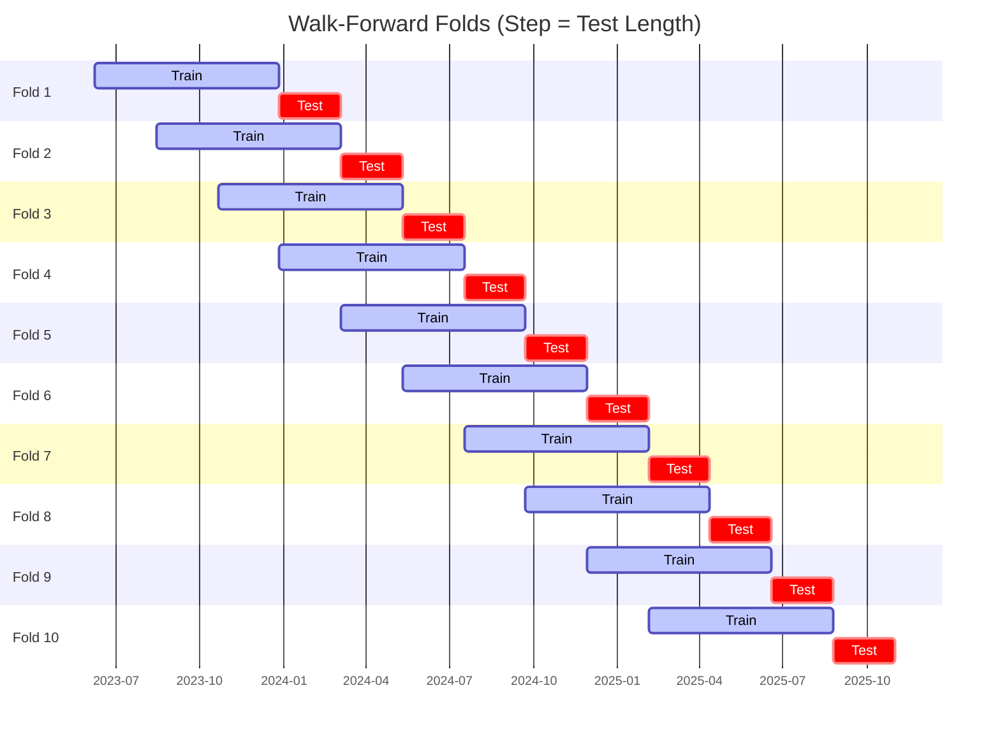

# Trading Strategy Pipeline Report

**Generated**: 2026-06-08 09:24:47

## Executive Summary

**WFO Training/Test period:** 2023-06-09 -> 2026-06-08  
**YTD performance window:** 2025-06-08 -> 2026-06-08  
**Coins:** 2

| | WFO Full Range | YTD |
|-|----------------|--------|
| Strategy CAGR | 13.80% | 3.38% |
| BTC buy & hold CAGR | 38.80% ❌ | -33.09% ✅ |
| S&P 500 CAGR | 21.27% ❌ | 25.35% ❌ |
| Strategy Sharpe | 0.54 | 0.26 |
| Max Drawdown | -30.40% | -20.08% |
| Total Trades | 167 | 56 |
| Win Rate | 35.33% | 35.71% |

## Result Validation (Training/Test Data)
**Period: 2023-06-09 -> 2026-06-08** — WFO-selected parameters replayed on the full training/test range.

### Combined Portfolio Performance

| Metric | Strategy | BTC (buy & hold) | S&P 500 (SPY) |
|--------|----------|------------------|---------------|
| Total Return | 47.32% | 167.21% | 78.28% |
| CAGR | 13.80% | 38.80% | 21.27% |
| Sharpe Ratio | 0.5363 | 0.9477 | 1.2206 |
| Max Drawdown | -30.40% | -49.89% | -14.53% |
| Total Trades | 167 | 1 | 1 |
| Win Rate | 35.33% | - | - |

## YTD Performance
**Period: 2025-06-08 -> 2026-06-08** — WFO-selected parameters replayed on the YTD window, no re-optimization.

| Metric | Strategy | BTC (buy & hold) | S&P 500 (SPY) |
|--------|----------|------------------|---------------|
| Total Return | 3.38% | -33.06% | 25.31% |
| CAGR | 3.38% | -33.09% | 25.35% |
| Sharpe Ratio | 0.2577 | -0.7950 | 2.3112 |
| Max Drawdown | -20.08% | -49.89% | -7.54% |
| Total Trades | 56 | 1 | 1 |
| Win Rate | 35.71% | - | - |

## Per-Coin Strategy Selection (WFO)

Best performing strategy per coin based on robustness scores (highest first).

| Symbol | Strategy | Selection | Robustness Score |
|--------|----------|-----------|------------------|
| TRX-USD | bbands_mean_reversion+atr_trailing | textbook_gates_then_sortino | -3.7667 |
| DOGE-USD | rsi_reversal+atr_trailing | textbook_gates_then_sortino | -9.7011 |

### WFO Fold Timeline

### WFO Out-of-Sample Sharpe — Per Fold

Per-fold OOS Sharpe for each coin's winning strategy (folds ordered as above). Negative = strategy did not generalise.

| Symbol | Strategy+Exit | IS Rob | OOS Rob | Consistency | Fold 1 | Fold 2 | Fold 3 | Fold 4 | Fold 5 | Fold 6 | Fold 7 | Fold 8 | Fold 9 | Fold 10 |
|--------|---------------|--------|---------|-------------|--------|--------|--------|--------|--------|--------|--------|--------|--------|--------|
| TRX-USD | bbands_mean_reversion+atr_trailing | -3.7667 | 2.5983 | 80% | 4.902 | -0.206 | 0.911 | 1.659 | 2.102 | 1.319 | 0.813 | -0.235 | 4.498 | 0.845 |
| DOGE-USD | rsi_reversal+atr_trailing | -9.7011 | 0.5137 | 60% | 1.191 | 0.763 | -0.946 | -1.891 | 3.833 | 0.409 | -2.818 | -1.031 | 2.076 | 0.366 |

## Full-Period Performance (Per-Coin)

Performance metrics from running WFO-selected parameters on full-range data.

| Symbol | Strategy | Exit | Selection | Return % | Sharpe | Max DD % | Trades | Win Rate % |
|--------|----------|------|-----------|----------|--------|----------|--------|-----------|
| TRX-USD | bbands_mean_reversion | atr_trailing | trade_freq_fallback | 7.84% | 0.6291 | -4.53% | 82 | 40.24% |
| DOGE-USD | rsi_reversal | atr_trailing | textbook_gates_then_sortino | 6.95% | 0.4271 | -6.64% | 91 | 29.67% |

---

*For pipeline methodology, fold structure, and benchmark definitions see [docs/architecture.md](../../../docs/architecture.md).*

---

*Report generated by ggTrader Pipeline*