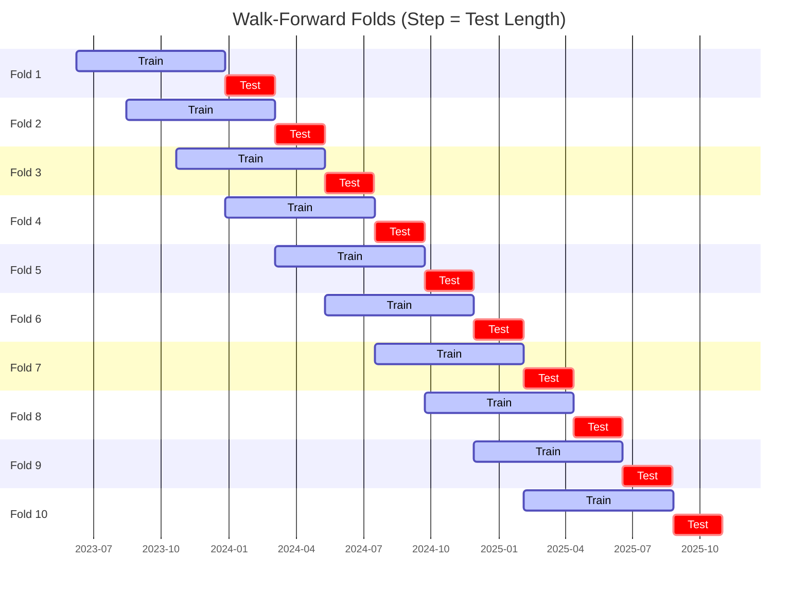

# Trading Strategy Pipeline Report

**Generated**: 2026-06-08 11:05:52

## Executive Summary

**WFO Training/Test period:** 2023-06-09 -> 2026-06-08  
**YTD performance window:** 2025-06-08 -> 2026-06-08  
**Coins:** 2

| | WFO Full Range | YTD |
|-|----------------|--------|
| Strategy CAGR | -10.02% | -21.18% |
| BTC buy & hold CAGR | 31.81% ❌ | -40.71% ✅ |
| S&P 500 CAGR | 21.27% ❌ | 25.35% ❌ |
| Strategy Sharpe | -0.07 | -0.71 |
| Max Drawdown | -54.96% | -34.18% |
| Total Trades | 172 | 55 |
| Win Rate | 29.07% | 32.73% |

## Result Validation (Training/Test Data)
**Period: 2023-06-09 -> 2026-06-08** — WFO-selected parameters replayed on the full training/test range.

### Combined Portfolio Performance

| Metric | Strategy | BTC (buy & hold) | S&P 500 (SPY) |
|--------|----------|------------------|---------------|
| Total Return | -27.13% | 128.86% | 78.28% |
| CAGR | -10.02% | 31.81% | 21.27% |
| Sharpe Ratio | -0.0700 | 0.8324 | 1.2207 |
| Max Drawdown | -54.96% | -51.94% | -14.53% |
| Total Trades | 172 | 1 | 1 |
| Win Rate | 29.07% | - | - |

## YTD Performance
**Period: 2025-06-08 -> 2026-06-08** — WFO-selected parameters replayed on the YTD window, no re-optimization.

| Metric | Strategy | BTC (buy & hold) | S&P 500 (SPY) |
|--------|----------|------------------|---------------|
| Total Return | -21.15% | -40.67% | 25.31% |
| CAGR | -21.18% | -40.71% | 25.35% |
| Sharpe Ratio | -0.7060 | -1.0640 | 2.3117 |
| Max Drawdown | -34.18% | -51.94% | -7.54% |
| Total Trades | 55 | 1 | 1 |
| Win Rate | 32.73% | - | - |

## Per-Coin Strategy Selection (WFO)

Best performing strategy per coin based on robustness scores (highest first).

| Symbol | Strategy | Selection | Robustness Score |
|--------|----------|-----------|------------------|
| SUI-USD | keltner_breakout+atr_trailing | textbook_gates_then_sortino | -4.5091 |
| DOGE-USD | ema_cross+trailing_stop | textbook_gates_then_sortino | -7.1556 |

### WFO Fold Timeline

### WFO Out-of-Sample Sharpe — Per Fold

Per-fold OOS Sharpe for each coin's winning strategy (folds ordered as above). Negative = strategy did not generalise.

| Symbol | Strategy+Exit | IS Rob | OOS Rob | Consistency | Fold 1 | Fold 2 | Fold 3 | Fold 4 | Fold 5 | Fold 6 | Fold 7 | Fold 8 | Fold 9 | Fold 10 |
|--------|---------------|--------|---------|-------------|--------|--------|--------|--------|--------|--------|--------|--------|--------|--------|
| SUI-USD | keltner_breakout+atr_trailing | -4.5091 | 0.6786 | 60% | 1.287 | -4.623 | -1.123 | 5.328 | 0.937 | 0.857 | -2.264 | 1.521 | 0.796 | -1.952 |
| DOGE-USD | ema_cross+trailing_stop | -7.1556 | 0.6685 | 60% | 0.912 | 0.519 | -1.342 | -2.244 | 3.631 | 0.155 | -2.789 | 1.089 | 3.583 | -0.932 |

## Full-Period Performance (Per-Coin)

Performance metrics from running WFO-selected parameters on full-range data.

| Symbol | Strategy | Exit | Selection | Return % | Sharpe | Max DD % | Trades | Win Rate % |
|--------|----------|------|-----------|----------|--------|----------|--------|-----------|
| DOGE-USD | ema_cross | trailing_stop | textbook_gates_then_sortino | 1.37% | 0.1075 | -7.79% | 99 | 27.27% |
| SUI-USD | keltner_breakout | atr_trailing | textbook_gates_then_sortino | -5.95% | -0.2266 | -14.23% | 78 | 29.49% |

---

*For pipeline methodology, fold structure, and benchmark definitions see [docs/architecture.md](../../../docs/architecture.md).*

---

*Report generated by ggTrader Pipeline*