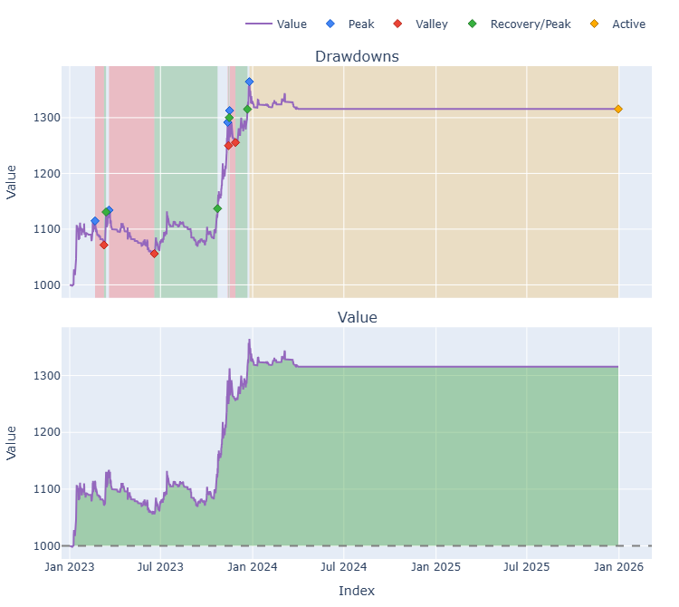

# Trading Strategy Pipeline Report

**Generated**: 2026-03-25 21:19:24

## Executive Summary

## Phase 2: Result Validation (Full Data)

### Combined Portfolio Performance (Full 3-Year Backtest)

| Metric | Strategy | Buy & Hold | Excess |
|--------|----------|------------|--------|
| Backtest period | n/a | - | - |
| Total Return | 0.00% | n/a | - |
| CAGR | n/a | n/a | n/a |
| Sharpe Ratio | 0.0000 | n/a | - |
| Max Drawdown | 0.00% | n/a | - |
| Total Trades | 0 | 0 | - |
| Win Rate | 0.00% | - | - |

## Phase 3: Recent Performance (Past Year)

*Phase 3 was not executed.*

## Phase 0: Sensitivity Analysis Findings

Analysis of parameter impact across expanded ranges for each strategy.

*No sensitivity phase was run (default pipeline omits Phase 0 unless you pass `--sensitivity`); WFO used the configured parameter grids directly.*

## Phase 1: Per-Coin Strategy Selection (From WFO)

Best performing strategy per coin based on robustness scores.

| Symbol | Strategy | Selection | Robustness Score |
|--------|----------|-----------|------------------|
| BTC-USD | psar_adx | wfo_robustness | 0.4713 |
| ETH-USD | rsi_reversal | wfo_robustness | 0.7879 |
| SOL-USD | rsi_reversal | wfo_robustness | 0.5882 |

### WFO Out-of-Sample Sharpe — Per Fold Breakdown

Per-fold OOS Sharpe for each coin's winning strategy. Negative values indicate the strategy did not generalise in that fold.

| Symbol | Strategy+Exit | IS Rob | OOS Rob | Consistency | Fold 1 | Fold 2 | Fold 3 | Fold 4 | Fold 5 | Fold 6 |
|--------|---------------|--------|---------|-------------|--------|--------|--------|--------|--------|--------|
| BTC-USD | psar_adx+trailing_stop | 1.9316 | -0.5176 | 33% | 0.138 | -0.218 | -0.726 | 2.332 | -3.780 | -0.319 |
| ETH-USD | rsi_reversal+fixed_sl_tp | 2.9055 | -0.5420 | 33% | 0.787 | -0.267 | -0.817 | -3.977 | 2.019 | -1.048 |
| SOL-USD | rsi_reversal+atr_trailing | 2.4415 | -0.7609 | 40% | n/a | -0.306 | 0.790 | -2.235 | 0.290 | -2.126 |

## Final Full-Period Performance (Per-Coin)

Performance metrics from running WFO-selected parameters on full 3-year data.

## Combined Portfolio Performance

Aggregate results when all configured symbols trade simultaneously with shared capital.

| Metric | Value |
|--------|-------|
| Starting Capital | $1,000 |
| Final Value | $0.00 |
| Total Profit/Loss | $0.00 |
| Return % | 0.00% |
| Sharpe Ratio | 0.0000 |
| Max Drawdown | 0.00% |
| Total Trades | 0 |
| Win Rate | 0.00% |

## Methodology

### Phase 0: Sensitivity Analysis
- Expanded parameter ranges tested for each entry strategy (PSAR+ADX, EMA Crossover, RSI Reversal)
- Grid search evaluated all parameter combinations on the configured symbol universe
- WFO train fold: metric from `TRAIN_METRIC` (sharpe / sortino / calmar); gates via `MIN_CLOSED_TRADES_TRAIN` and optional `MAX_TRAIN_DRAWDOWN_PCT`

### Phase 1: Per-Coin Multi-Strategy WFO
- Walk-Forward Optimization with 4 folds, 2:1 train/test ratio
- Each coin optimized independently with each strategy
- Best strategy selected per coin based on out-of-sample robustness score

### Phase 2: Result Validation (Full Data)
- WFO-selected strategy + parameters applied to full 3-year range for each coin
- Per-coin results combined into single portfolio with shared capital
- Performance compared against an equal-weight Buy & Hold benchmark

### Phase 3: Recent Performance (Past Year)
- Frozen parameters applied to the most recent 1-year data window
- Provides an 'out-of-sample' check on the most recent market conditions
- Performance compared against a 1-year Buy & Hold benchmark

### Reporting
- Comprehensive analysis of parameter sensitivity, strategy selection, and final performance
- Per-coin and combined portfolio metrics
- **CAGR**: geometric annualized return from total return over the calendar span between the first and last bar of the combined close matrix
- **Benchmark**: equal-weight buy-and-hold on the same symbols, first-bar entry and last-bar exit per leg, using the same `START_CASH`, `FEES`, `SLIPPAGE`, and bar frequency

## Plots

### Combined Portfolio Final Dashboard

---

*Report generated by ggTrader Pipeline*